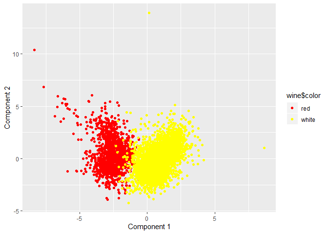

SDS\_Exercise3
================

# Predictive Model Building

### Problem

For this first question, our goal was to create a model that would be
able to predict the rent of buildings from Exercise 1. From there, we
should be able to take that model, and predict the change in rent if a
building’s green\_rating changed.

### Data and Model

We created 3 linear regression models to test various combinations of
attributes to see if they were good indicators of Rent. The first (V1)
was a combination of attributes related to age and size, the second (V2)
was only concerned with amenities, and the last (V3) looked at
gas/electricity costs and the number of heating/cool days in the region.
All three of these models also used the green\_rating. We decided to
lump LEED and EnergyStar together for simplicity as we did not see too
much difference between the two. The green\_rating attribute indicates
whether or not the building was green certified.

In our fourth linear regression model (V4), we combined all of these
elements and introduced interactions between attributes. We included
interactions between gas/electricity costs and total degree days as the
number of degree days will affect the cost of gas/electricity. We
included an interaction between age and renovation as a building that is
old but renovated will likely be more expensive than a building that is
only old and not renovated. The final interaction we had was between
gas/electricity costs and green\_rating, as a building will be more
energy efficient if it is a ‘green’ building, resulting in lower
gas/electricity costs. Other than those interactions, we also used
stories, size, and cluster\_rent as they were good/significant
predictors.

We tested these models on 100 different test/training splits. For each
split, we created the three linear models on a training set, predicted
Rent on a given test set, and calculated RMSE between the four models’
predictions and actual values for Rent. We selected different
test/training sets for each split.

As for predicting the average change in Rent given a change in
green\_rating, we took the entire dataset, flipped the green\_rating,
and predicted the Rent on the entire set using V4 with all other
attributes held constant. Once we had that value, we took the mean of
the differences between the predicted Rent and actual Rent of every
building. We did this within the test/training splits as well.

### Results

<!-- -->

    ##        V1        V2        V3        V4 
    ## 14.772572 15.031173 13.731533  9.346892

As seen above, the final model V4 outperforms the other three due to the
use of interactions as well as incorporating elements from the other
three models.

<!-- -->

    ##        V5        V6 
    ##  1.077597 -1.051898

V5 indicates the average change in Rent when a building that was
previously not green becomes green. V6 indicates the average change in
Rent when a building that was previously green becomes not green. As
seen above, if a building changes its green rating, the change in Rent
is approximately 1 dollar according to our model. That is, rent will be
$1.08 more expensive if a building becomes green, and $1.05 less
expensive if a building loses its green status.

### Conclusion

We were able to create a model using linear regression techniques to
predict a building’s rent, where the average RMSE of our model was 9.34.
From that model, we were able to project the change in rent given a
change in a building’s green\_rating while all other factors constant.
It appears if a building’s green\_rating status changes, the change in
rent will be around a dollar, either more expensive if the building was
previously not green or less expensive if the building was previously
green.

# What Causes What

### Question 1

The podcast talks about how the data is quite messy because high crime
cities have an incentive to hire a lot of police. This creates a direct
relation between police and crime, and causes the number of police
present depend on the crime and skews how the relation looks the other
way around.

### Question 2

The researchers were able to use Washington D.C.’s terrorism alert
system to create a situation where more police happened to be present
for reasons unrelated to crime. This let them ask on these alert days
what happens to crime when there are more police present on the street
and in various areas. The table shows how on high alert days, crime rate
is decreased by 5%. They were able to verify that the crime rate did not
decrease because people were scared of a terrorist threat by tracking
the number of people who took the metro. The number of people taking
metro barely changed, indicating that the number of people that stayed
inside due to a terrorist threat on these alert days did not change
significantly.

### Question 3

They were trying to see whether or not people were staying inside
because there was a terrorist threat. People staying at home rather than
robbing stores would explain the decrease in crime rather than the extra
number of police. However, they saw that the number of riders in the
metro (essentially the number of possible victims) did not change
significantly between high alert days and normal days. This meant that
the decrease in crime rate in D.C. was most likely caused by the higher
number of police that were present during these high alert days.

### Question 4

The model is estimating the reduction in crime on high alert days in
various districts. It can be seen that the district in D.C. has
significant decrease in crime rate in comparison to other districts that
did not have an increase in police during high alert days. This implies
the number of police present decreases the crime rate.

# Clustering and PCA

## The data

We are given data on the chemical properties of 6500 different bottles
of vinho verde wine from northern Portugal. We are also given the color
of each bottle of wine, and it’s quality as determined by a panel of
wine tasters. The goal is to determine if various methods of
dimensionality reduction are capable of separating the bottles of wine
by color and quality using only their chemical properties

## PCA

The first method we will test is Principle Component Analysis. Here is a
biplot of the first 2 PC’s of a second order PCA of the data:

<!-- -->

The first PC axis seems to primarily assign red wines negative values
and white wines positive values. Examining PC1 further, these are the 11
chemical properties sorted from most negatively associated with PC1 to
most positively assoiated:

    ##     volatile.acidity            chlorides            sulphates 
    ##           -0.3934947           -0.3219381           -0.3098422 
    ##        fixed.acidity                   pH              density 
    ##           -0.2666771           -0.2060287           -0.1076854 
    ##          citric.acid       residual.sugar  free.sulfur.dioxide 
    ##            0.1405374            0.3112802            0.4216289 
    ## total.sulfur.dioxide 
    ##            0.4753293

## K-means++

The next method we will test is K-means++ clustering. With k=2 and
nstart=25, we get two clusters, the first consisting of 4836 white wines
and 24 red wines, and the second consisting of 62 white wines and 1575
red wines, indicating that k-means++ is very capable of distinguishing
between red and white wines.

## Quality

We will now determine if k-means++ is also capable of distinguishing the
quality of wine based on it’s chemical properties by using a larger
number of clusters. Running k-means++ on the same data but using k=4
instead we get 4 clusters with a respective average quality of
6.1685468, 5.6551929, 5.3090909, and 5.8946738 respectively. These all
are all very close to both each other and the average quality of the
entire data set, indicating that k-means++ did not significantly
separate the wines based on quality in this case.

## Conclusion

While both methods seem to be able to distinguish wine color, we believe
that k-means++ makes more sense than PCA for this data set because the
size of the data set is much larger than the number of attributes used.
However principal component analysis did reveal some potentially useful
information. Namely that qualities like high volatile acidity and
chloride composition are associated with red wines and qualities like
residual sugar and sulfur dioxide are associated with white wines.
However, k-means++ was not able to distinguish the quality of wines.
More research would be needed to determine if this is a failure of the
choice of technique or if these specific chemical properties are not
indicative of quality.
