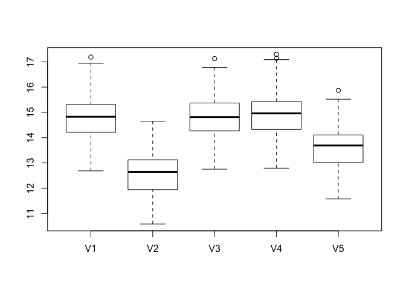

SDS\_Exercise3
================

## GitHub Documents

This is an R Markdown format used for publishing markdown documents to
GitHub. When you click the **Knit** button all R code chunks are run and
a markdown file (.md) suitable for publishing to GitHub is generated.

## Including Code

You can include R code in the document as follows:

``` r
rmse_vals
```

    ##           V1       V2       V3       V4       V5
    ## 1   14.89261 12.72266 14.78926 15.10082 13.75833
    ## 2   14.41640 12.11358 14.42941 14.51822 13.20987
    ## 3   15.02051 12.85696 15.02152 15.08801 13.88542
    ## 4   15.57299 13.17200 15.48891 15.81853 14.36436
    ## 5   13.47487 11.21997 13.48529 13.51874 12.35603
    ## 6   14.30186 12.16523 14.34058 14.39743 13.02253
    ## 7   14.03147 11.94686 14.14336 14.16086 13.02091
    ## 8   14.68218 12.37460 14.73327 14.78465 13.27925
    ## 9   14.57916 12.45121 14.57126 14.72979 13.52138
    ## 10  14.28482 12.16110 14.35907 14.41697 13.00832
    ## 11  14.91238 12.65170 14.96697 14.98620 13.79341
    ## 12  14.04115 11.84125 14.09580 14.13094 12.87185
    ## 13  16.87952 14.23345 16.77957 17.08664 15.42688
    ## 14  14.41635 11.90800 14.51305 14.60281 13.05633
    ## 15  14.69652 12.57397 14.62201 14.79592 13.55938
    ## 16  15.63508 13.57124 15.55464 15.74824 14.48975
    ## 17  15.08649 12.89431 15.07707 15.22425 13.98953
    ## 18  15.26500 12.97222 15.17092 15.39735 14.07583
    ## 19  14.97581 12.99529 14.98862 15.15681 13.91854
    ## 20  15.04781 12.60034 15.10005 15.22676 13.71128
    ## 21  14.47759 12.10753 14.56786 14.64957 13.17050
    ## 22  14.12791 11.89222 14.13517 14.22692 12.84875
    ## 23  15.12422 13.06628 15.08757 15.32801 14.02863
    ## 24  14.86325 12.65597 14.91144 14.99153 13.66402
    ## 25  17.18608 14.65083 17.12601 17.29557 15.86558
    ## 26  15.21323 12.96688 15.24167 15.37639 14.02525
    ## 27  15.23515 13.28055 15.27051 15.43918 14.17045
    ## 28  15.17123 12.90960 15.21127 15.35060 13.95308
    ## 29  14.73009 11.90379 14.74037 14.81533 13.29896
    ## 30  16.34219 14.02758 16.24649 16.55454 15.10101
    ## 31  13.90311 12.00415 13.94634 14.02033 13.11094
    ## 32  14.18508 11.85133 14.25352 14.26785 12.94547
    ## 33  16.62838 14.11469 16.52805 16.91305 15.38794
    ## 34  14.73803 12.51957 14.72765 14.89849 13.51592
    ## 35  16.03099 13.58538 16.02483 16.11310 14.67553
    ## 36  15.14840 12.70007 15.13226 15.21281 13.94729
    ## 37  14.47366 12.50007 14.41758 14.70101 13.48845
    ## 38  14.53898 12.44162 14.57573 14.57323 13.39398
    ## 39  14.56026 12.28088 14.49833 14.73012 13.39777
    ## 40  13.68245 11.37206 13.75568 13.78131 12.54248
    ## 41  13.77533 11.43939 13.85544 13.90429 12.58737
    ## 42  14.87041 12.70919 14.86051 15.15524 13.73062
    ## 43  16.37646 14.07880 16.32018 16.51826 15.18379
    ## 44  14.23676 11.93810 14.29902 14.37936 13.22097
    ## 45  15.43715 12.93642 15.40998 15.54077 14.08625
    ## 46  14.30973 12.44574 14.36327 14.37848 13.30591
    ## 47  14.47405 12.02377 14.49764 14.55468 13.06181
    ## 48  15.93957 13.45936 15.95328 16.05314 14.71788
    ## 49  15.91859 13.62881 15.85284 16.08317 14.67183
    ## 50  15.96340 13.98859 15.95521 16.09113 15.08005
    ## 51  16.36916 14.06830 16.31201 16.61563 15.09730
    ## 52  14.06600 11.70985 14.18951 14.21789 12.82824
    ## 53  16.94126 14.19964 16.76284 17.14066 15.52105
    ## 54  14.78644 12.53935 14.68539 14.92145 13.63990
    ## 55  14.07410 11.78880 14.02323 14.18077 12.89949
    ## 56  14.89181 12.69162 14.93936 15.02743 13.84843
    ## 57  12.68428 10.57952 12.75108 12.86793 11.57645
    ## 58  15.18420 13.04413 15.06864 15.31928 14.02241
    ## 59  15.15688 12.99148 15.16368 15.21363 13.96224
    ## 60  14.55286 12.23597 14.56996 14.65214 13.34525
    ## 61  15.54832 13.34952 15.57900 15.64225 14.45204
    ## 62  12.80183 10.85031 12.95910 12.93576 11.86340
    ## 63  15.04529 12.97497 15.10173 15.15716 13.93171
    ## 64  13.95014 11.72367 14.01413 14.08700 12.86964
    ## 65  15.22959 12.79391 15.19633 15.38545 13.79686
    ## 66  16.17181 14.16437 16.15810 16.37105 15.13368
    ## 67  14.77312 12.93974 14.79011 14.90933 13.92735
    ## 68  14.82621 12.41174 14.81621 14.96728 13.63139
    ## 69  15.66199 13.23737 15.61411 15.76484 14.29687
    ## 70  15.83305 13.29593 15.77224 15.95423 14.51683
    ## 71  16.57938 14.04228 16.54435 16.69893 15.23860
    ## 72  13.81243 11.84576 13.91814 13.92224 12.82170
    ## 73  14.08406 11.80414 14.11093 14.12672 12.96043
    ## 74  15.34823 12.88020 15.41497 15.43101 14.02286
    ## 75  14.29516 12.14642 14.27594 14.48985 13.35906
    ## 76  15.70041 13.24642 15.69691 15.80240 14.34944
    ## 77  15.40538 13.32430 15.46641 15.51514 14.36332
    ## 78  14.39525 12.66913 14.41183 14.68531 13.65816
    ## 79  14.09756 12.01522 14.17426 14.21849 12.98804
    ## 80  13.87608 11.39376 13.85402 14.03084 12.58710
    ## 81  13.63370 11.45810 13.67402 13.68917 12.33528
    ## 82  14.80898 12.45759 14.85237 14.91715 13.62378
    ## 83  15.27061 12.98601 15.26759 15.35732 14.08141
    ## 84  15.28214 13.18506 15.33062 15.40101 14.12833
    ## 85  14.94138 12.82767 14.92774 15.07540 13.90000
    ## 86  15.65652 13.42149 15.64800 15.72439 14.47055
    ## 87  14.12670 11.86875 14.06441 14.23714 12.98269
    ## 88  13.33312 11.38685 13.37010 13.44566 12.24658
    ## 89  15.21948 12.99596 15.15769 15.31930 14.02108
    ## 90  14.28038 11.98731 14.29052 14.43280 13.07807
    ## 91  15.82623 13.73506 15.87906 15.98031 14.72776
    ## 92  13.60827 11.39891 13.66747 13.76880 12.49571
    ## 93  13.84107 11.82813 13.87841 13.91128 12.78583
    ## 94  13.73345 11.59911 13.73414 13.87932 12.54029
    ## 95  14.82729 12.63804 14.81397 14.95046 13.75064
    ## 96  14.34941 12.28099 14.39378 14.43281 13.21782
    ## 97  14.01602 11.69160 14.06486 14.09454 12.88629
    ## 98  15.64674 13.30196 15.68261 15.77930 14.47087
    ## 99  12.72005 10.68968 12.76543 12.79146 11.65121
    ## 100 14.94944 12.80375 14.99254 15.05125 13.83485

``` r
colMeans(rmse_vals)
```

    ##       V1       V2       V3       V4       V5 
    ## 14.84088 12.60405 14.84786 14.97278 13.67236

``` r
boxplot(rmse_vals)
```

<!-- -->

## Including Plots

You can also embed plots, for example:

<!-- -->

Note that the `echo = FALSE` parameter was added to the code chunk to
prevent printing of the R code that generated the plot.
